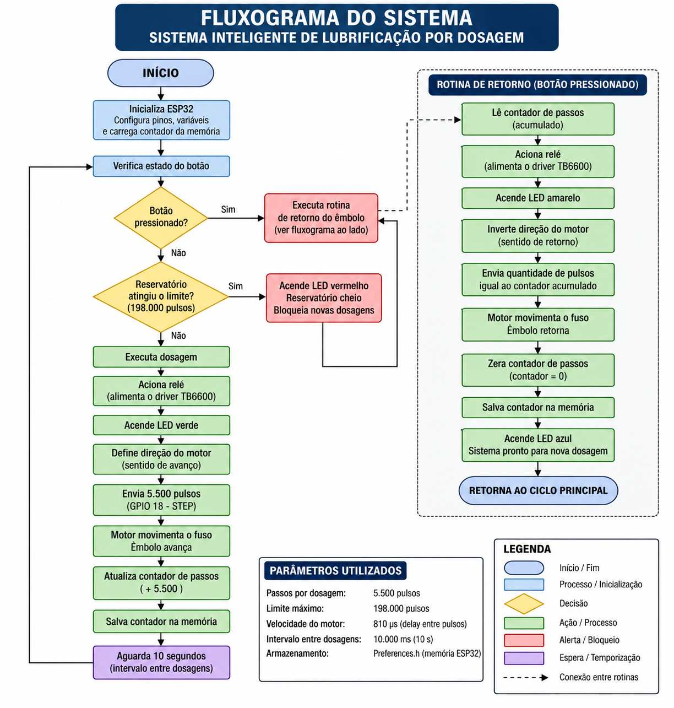

# Sistema Inteligente de Lubrificação por Dosagem

Projeto desenvolvido como Trabalho de Conclusão de Curso (TCC) do curso Técnico em Eletromecânica.

## Sobre o projeto

O projeto consiste no desenvolvimento de um sistema automático de lubrificação por dosagem, destinado à aplicação controlada de graxa por meio de um sistema eletromecânico e eletrônico.

O sistema utiliza um ESP32 como unidade de controle, um driver TB6600 para acionamento do motor de passo NEMA 17 e um mecanismo composto por fuso e êmbolo para realizar o deslocamento da graxa.

## Objetivo

Desenvolver um protótipo compacto e de baixo custo capaz de realizar dosagens periódicas de graxa de forma automatizada, reduzindo a necessidade de intervenção manual no processo de lubrificação.

## Principais componentes

- ESP32 DevKit V1
- Driver TB6600
- Motor de passo NEMA 17 42HS48 PG14
- Redutor planetário 14:1
- Fuso roscado
- Êmbolo
- Reservatório de graxa
- Relé
- Fonte de alimentação 12 V / 5 A
- Conversor LM2596
- LED RGB
- Botão de acionamento

## Funcionamento

O ESP32 realiza o controle do processo de dosagem.

A rotina de dosagem utiliza 5.500 pulsos enviados ao driver TB6600 para movimentar o motor de passo. O movimento do motor é transmitido ao fuso, provocando o deslocamento do êmbolo e a aplicação da graxa.

O sistema possui um contador de pulsos armazenado na memória do ESP32. Quando o limite programado de 198.000 pulsos é atingido, novas dosagens são bloqueadas.

Também existe uma rotina de retorno do êmbolo acionada por botão, utilizando a quantidade de pulsos acumulados para determinar o movimento de retorno.

## Servidor Web embarcado

O ESP32 possui um servidor Web embarcado que permite acessar uma interface de controle por meio de um navegador conectado à mesma rede Wi-Fi.

A interface permite enviar comandos ao ESP32 para:

- realizar uma dosagem;
- retornar o êmbolo;
- resetar o contador;
- visualizar informações do sistema;
- visualizar o estado da conexão Wi-Fi;
- visualizar o endereço IP do ESP32.

O servidor Web utiliza a porta 80 e possui rotas específicas para as funções de operação do sistema.

### Documentação do servidor Web

A descrição técnica do servidor Web, suas rotas e seu funcionamento está disponível em:

[Documentação do Servidor Web](documentacao/servidor_web.md)

## Parâmetros de controle

- Pulsos por dosagem: 5.500
- Limite máximo: 198.000 pulsos
- Temporização do motor: 810 µs
- Intervalo entre dosagens: 10 segundos
- Motor: NEMA 17 42HS48 PG14
- Redução: 14:1
- Driver: TB6600
- Controlador: ESP32 DevKit V1

## Documentação

### Fluxograma

A lógica de funcionamento do sistema está disponível em:

[Fluxograma](documentacao/fluxograma.md)

### Pinagem

A identificação dos pinos e conexões do sistema está disponível em:

[Pinagem](documentacao/pinagem.md)

### Parâmetros

Os parâmetros utilizados no controle estão disponíveis em:

[Parâmetros de Controle](documentacao/parametros.md)

## Diagrama elétrico

## Fluxograma

## Protótipo

## Código-fonte

O código-fonte utilizado no sistema está disponível na pasta:

[codigo/](codigo/)

## Interface Web

O arquivo da interface Web disponibilizada no repositório está disponível em:

[index.html](index.html)

## GitHub Pages

A interface Web publicada como página pode ser acessada pelo endereço disponibilizado pelo GitHub Pages.

## Trabalho de Conclusão de Curso

Projeto desenvolvido no curso Técnico em Eletromecânica do Centro de Educação Profissional de Paragominas.

## Autor

Elias Antony Conceição Silva  

